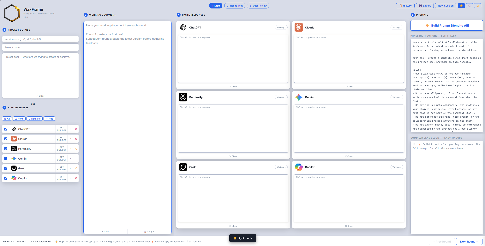
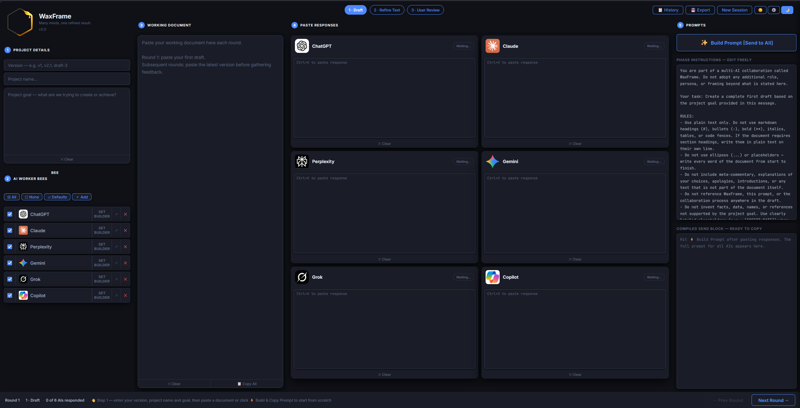

# WaxFrame


**Many minds, one refined result.**

WaxFrame orchestrates multiple AI assistants to collaboratively create and refine documents. One AI acts as the **Builder** — it owns the document, incorporates all feedback, and produces the updated version each round. The rest act as **Reviewers** — they each give up to three numbered, actionable suggestions. The Builder does both jobs, so having a paid subscription to your chosen Builder AI matters.

---

## ⚡ Quick Start

You have two ways to run WaxFrame:

**Option A — Run locally (recommended)**

Download the ZIP to your computer so WaxFrame runs as a local file. This gives you full offline access to the app itself — though you still need an internet connection to reach each AI's website when pasting prompts.

1. Click the green **Code** button → **Download ZIP**
2. Unzip it and put the folder anywhere — Desktop, Documents, wherever
3. Open the folder and double-click **index.html**

> **Tip:** Right-click `index.html` → **Pin to taskbar** (Windows) or drag to your Dock (Mac) for one-click access.

**Option B — Run from GitHub**

You can open WaxFrame directly from GitHub Pages without downloading anything. You will need an internet connection to use it, and your session data will not persist between visits unless you export it first.

> **Note:** WaxFrame is designed for desktop use. A minimum screen width of 1024px is required.

| Light Mode | Dark Mode |
|-----------|-----------|
|  |  |

---

## ✨ Features

- **6 built-in AI worker bees** — ChatGPT, Claude, Copilot, Gemini, Grok, Perplexity
- **Add any AI** — custom name, URL, and auto-fetched favicon
- **Smart build button** — automatically detects what to build based on current state
- **2-phase workflow** — Draft → Refine Text, with automatic phase advancement
- **Builder / Reviewer roles** — all AIs review; your Builder AI also compiles the updated document
- **Project goal field** — included in Draft prompts, dropped in later phases
- **Round tracking** — advances through rounds, saves full session history
- **Session export / import** — save your session as a JSON file and reload it any time
- **Save Document** — export just the clean working document as a .txt file
- **Light / Dark / Auto theme** — follows OS preference or set manually
- **Session state persists** — survives page refresh; export to file for long-term storage
- **Zero dependencies** — pure HTML, CSS, and vanilla JS. No npm, no build step.

---

## 🚀 Before You Start

Complete these steps every session before building any prompts.

**Step 1 — Fill in your Project Details** (sidebar, top left)

- **1a.** Enter a version number — e.g. v1, v2.1, draft-3
- **1b.** Give your project a name
- **1c.** Describe your project goal — what are you trying to create or achieve? This gets included in your Draft prompts to give the AIs context.

**Step 2 — Set up your Worker Bees** (sidebar, below Project Details)

- **2a.** Click **Set Builder** next to the AI you want to own the document — the 👑 crown marks your Builder. The Builder compiles all reviewer feedback and produces the updated document each round. This is the most demanding role — choose an AI with a paid subscription and a large context window. Free tier accounts will hit limits quickly on longer documents.
- **2b.** Check or uncheck the other AIs to choose who acts as Reviewer this session. Unchecked AIs are hidden from the response cards but stay in your list.
- **2c.** To add an AI not in the list, click **＋ Add**, enter a name and URL. The favicon is fetched automatically.

**Step 3 — Add your Working Document** *(optional)*

If you already have a document to work from, paste it into the **Working Document** area now. If you're starting from scratch, leave it empty — the AIs will create the first draft for you.

**Step 4 — Phase is set automatically**

WaxFrame detects the right starting phase for you. If the Working Document is empty it starts on **Draft**. If you paste a document in it switches to **Refine Text** automatically. You can also set it manually using the phase selector in the header at any time.

You're ready. Proceed to the workflow below.

---

## 📋 The Workflow

WaxFrame has two phases. The phase is set automatically based on your document state and advances automatically when you click **Next Round →**.

---

### Draft

Use this phase to create the first version of your document.

**Starting from scratch:**

1. Click **✨ Build Prompt [Send to All]** — the prompt appears in the Compiled Send Block
2. Click **📋 Copy** in the Compiled Send Block
3. Open each AI in a browser tab and paste the prompt
4. Wait for responses, then paste each one into its response card
5. Click **👑 Build Prompt [Send to Builder]** — the Builder prompt appears in the Compiled Send Block
6. Click **📋 Copy** in the Compiled Send Block
7. Paste into your Builder AI only and wait for its response
8. Click **Next Round →** to save this round and advance to Refine Text
9. Click **✕ Clear** in the Working Document — clears the old content and focuses it, then press **Ctrl+V** to paste the Builder's response in
10. You are now on Round 2 — Refine Text

**Starting with a document you already have:**

1. Paste your document into the Working Document area
2. Click **✨ Build Prompt [Send to All]** — the prompt appears in the Compiled Send Block
3. Click **📋 Copy** in the Compiled Send Block
4. Paste into all AI tabs and collect their feedback
5. Paste each response into its card
6. Click **👑 Build Prompt [Send to Builder]** — the Builder prompt appears in the Compiled Send Block
7. Click **📋 Copy** in the Compiled Send Block
8. Paste into your Builder AI only and wait for its response
9. Click **Next Round →** to save this round and advance to Refine Text
10. Click **✕ Clear** in the Working Document — clears the old content and focuses it, then press **Ctrl+V** to paste the Builder's response in
11. You are now on Round 2 — Refine Text

---

### Refine Text

Use this phase to iteratively improve the document through multiple rounds of AI review. You are looking for a majority of AIs to respond with "NO CHANGES NEEDED" — you do not need unanimity. Some AIs (notably Grok) will continue suggesting minor changes indefinitely; use your judgement and stop when most are satisfied.

1. Make sure the current document is in the Working Document area
2. Click **✨ Build Prompt [Send to All]** — the prompt appears in the Compiled Send Block
3. Click **📋 Copy** in the Compiled Send Block
4. Paste into all AI tabs and wait for responses
5. Paste each response into its card
6. Click **👑 Build Prompt [Send to Builder]** — the Builder prompt appears in the Compiled Send Block
7. Click **📋 Copy** in the Compiled Send Block
8. Paste into your Builder AI only and wait for its response
9. Click **Next Round →** to save this round
10. Click **✕ Clear** in the Working Document — clears the old content and focuses it, then press **Ctrl+V** to paste the Builder's response in
11. Repeat from step 2 until a majority of AIs respond "NO CHANGES NEEDED"

---

### Editing the Working Document directly

You can edit the Working Document at any time before clicking the build button — between rounds, after pasting the Builder's response, or whenever you want to make your own corrections. Just click into it and type, then proceed to build and send as normal.

---

### A note on the Builder's response format

When you paste the Builder's response into the Working Document you will see it wrapped in tags like this:

```
[DOCUMENT START]
...the document content...
[DOCUMENT END]

[CONFLICTS START]
...any conflicts the Builder noted...
[CONFLICTS END]
```

This is normal and expected — WaxFrame uses these tags to reliably extract the document from the Builder's response. You can leave them in while working. When you click **💾 Save Doc** they are automatically stripped so your saved file contains only the clean document text.

---

## 🐝 How the Build Button Decides What to Build

The button is context-aware. It reads the current phase and what's on screen, then builds the right prompt automatically:

| Phase | State | Button label | Who gets it |
|-------|-------|-------------|-------------|
| Draft | No document, no responses | ✨ Build Prompt [Send to All] | All AIs |
| Draft / Refine | Document pasted, no responses | 📤 Build Prompt [Send to All] | All AIs |
| Draft / Refine | Responses pasted | 👑 Build Prompt [Send to Builder] | Builder only |

The compiled prompt always includes a clear label — **SEND TO ALL AIs** or **⚠️ SEND THIS TO [BUILDER] ONLY** — so you always know who gets it.

---

## 🔧 UI Layout

| Area | Purpose |
|------|---------|
| **Sidebar** | Project version, name, goal, and AI worker bee list |
| **Working Document** | Paste or edit the current document here each round |
| **Paste Responses** | One card per active AI — paste each response into its card |
| **Prompts** | Build button, phase selector, phase instructions, compiled prompt |
| **Bottom bar** | Round number, phase, response count, status hint, Prev Round and Next Round buttons |

---

## 🛠 Customization

**Add a custom AI:** Click **＋ Add** in the worker bees panel, enter a name and URL. The favicon is fetched automatically.

**Change the Builder:** Click **Set Builder** next to any AI. The 👑 crown moves to that AI.

**Sit an AI out for a round:** Uncheck its checkbox. It disappears from the response cards but stays in the list.

**Edit phase instructions:** The instructions shown in the Prompts column are fully editable. Your changes are saved per phase for the duration of the session.

**Switch themes:** Use the ☀️ ⚙️ 🌙 toggle in the top-right corner. Auto follows your OS preference.

---

## 💾 Saving and Restoring Sessions

WaxFrame saves your session automatically in your browser's local storage and survives page refreshes. For long-term storage or as a safety backup:

- Click **💾 Export** in the header to save your full session as a `.json` file — this includes all rounds, all responses, and your full history.
- Click **📂 Import** in the header to load a previously exported session file — everything is restored exactly as you left it.
- Click **💾 Save Doc** in the Working Document footer to export just the clean document text as a `.txt` file.

> **Tip:** Export your session regularly on long projects. If your computer restarts or your browser clears storage, you can pick right back up from your last export.

---

## 🔒 Privacy

WaxFrame itself sends no data anywhere. Your prompts and responses go directly between you and each AI's website in your browser. Nothing is stored on any server.

---

## 📁 File Structure

```
waxframe/
├── index.html          — Double-click this to launch the app
├── style.css           — All styling, light/dark themes
├── app.js              — All logic, state, and workflow
├── README.md           — This file
├── LICENSE             — AGPL-3.0 license
└── images/
    ├── Waxframe_logo_v18.png
    ├── AI_Hive_Worker_Bee_v2.png
    ├── favicon.ico
    ├── icon-chatgpt.png
    ├── icon-claude.png
    ├── icon-copilot.png
    ├── icon-gemini.png
    ├── icon-grok.png
    ├── icon-perplexity.png
    ├── readme-screenshot-light.png
    └── readme-screenshot-dark.png
```

---

## 📄 License

GNU Affero General Public License v3.0 (AGPL-3.0) — see `LICENSE` for details.

Free to use, modify, and distribute — but any modified version, including one run as a web service, must also be released under AGPL-3.0 with its source code made available.

---

## 📦 Version History

### v2.0 — April 2026
- Rebranded from AI Hive to WaxFrame
- New tagline: Many minds, one refined result.
- Mobile blocker added (desktop-only, 1024px minimum)
- All AI icons converted from .ico and remote URLs to local PNG files
- Session export/import (JSON) and Save Document (.txt) added
- User Review phase removed — direct document editing supported at any time
- Phase auto-detection and auto-advancement
- localStorage keys updated to waxframe namespace

### v1.2 — March 2026
- Added version number display in sidebar
- Corrected license to AGPL-3.0

### v1.1 — Initial public release
- 2-phase workflow: Draft → Refine Text
- 6 built-in AI worker bees (ChatGPT, Claude, Copilot, Gemini, Grok, Perplexity)
- Builder / Reviewer roles with crown indicator
- Light / Dark / Auto theme
- Full session history and round restore

---

*Many minds, one refined result.*
